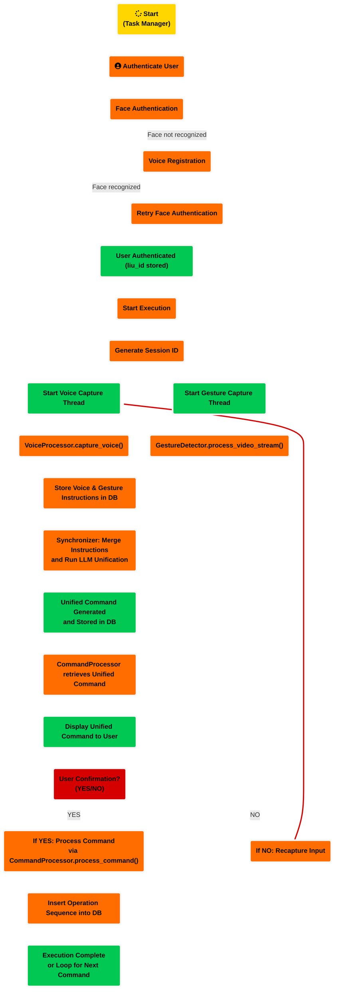

# Integrating CV, LLM, and Robot Control

```mermaid
%%{init: {"look": "classic", "theme": "mc", "layout": "fixed", "themeVariables": {
  "primaryColor": "#000",
  "primaryTextColor": "#FFFFFF",
  "primaryBorderColor": "#8E44AD",
  "lineColor": "#FFFFFF",
  "fontSize": "16px",
  "secondaryColor": "#FFFFFF",
  "tertiaryColor": "#FFFFFF",
}}}%%

flowchart TB
    classDef nodeStyle fill:#00C853, stroke:#faf7f7, stroke-width:4px, font-weight:bold, color:#000000;
    classDef decisionStyle fill:#D50000, stroke:#faf7f7, stroke-width:4px, font-weight:bold, color:#000000;
    classDef processStyle fill:#FF6D00, stroke:#faf7f7, stroke-width:4px, font-weight:bold, color:#000000;

    %% Nodes

    A(["fa:fa-spinner Start<br>(Task Manager)"]):::nodeStyle
    B["fa:fa-circle-user Authenticate User"]:::processStyle
    C["Face Authentication"]:::processStyle
    D["Voice Registration"]:::processStyle
    E["Retry Face Authentication"]:::processStyle
    F["User Authenticated (liu_id stored)"]:::nodeStyle
    G["Start Execution"]:::processStyle
    H["Generate Session ID"]:::processStyle
    I["Start Voice Capture Thread"]:::nodeStyle
    J["Start Gesture Capture Thread"]:::nodeStyle
    K["VoiceProcessor.capture_voice()"]:::processStyle
    L["GestureDetector.process_video_stream()"]:::processStyle
    M["Store Voice & Gesture Instructions in DB"]:::processStyle
    N["Synchronizer: Merge Instructions<br>and Run LLM Unification"]:::processStyle
    O["Unified Command Generated<br>and Stored in DB"]:::nodeStyle
    P["CommandProcessor retrieves Unified Command"]:::processStyle
    Q["Display Unified Command to User"]:::nodeStyle
    R{"User Confirmation?<br>(YES/NO)"}:::decisionStyle
    S["If YES: Process Command<br>via CommandProcessor.process_command()"]:::processStyle
    T["Insert Operation Sequence into DB"]:::processStyle
    U["If NO: Recapture Input"]:::processStyle
    V["Execution Complete<br>or Loop for Next Command"]:::nodeStyle

    %% Connections
    A --> B
    B --> C
    C -- "Face recognized" --> F
    C -- "Face not recognized" --> D
    D --> E
    E --> F
    F --> G
    G --> H
    H --> I
    H --> J
    I --> K
    J --> L
    K & L --> M
    M --> N
    N --> O
    O --> P
    P --> Q
    Q --> R
    R -- "YES" --> S
    R -- "NO" --> U
    S --> T
    T --> V
    U --> I


    %% Styles
    A:::nodeStyle
    B:::processStyle
    C:::processStyle
    F:::nodeStyle
    D:::processStyle
    E:::processStyle
    G:::processStyle
    H:::processStyle
    I:::nodeStyle
    J:::nodeStyle
    K:::processStyle
    L:::processStyle
    M:::processStyle
    N:::processStyle
    O:::nodeStyle
    P:::processStyle
    Q:::nodeStyle
    R:::decisionStyle
    S:::processStyle
    U:::processStyle
    T:::processStyle
    V:::nodeStyle

  %% Shape
  A@{ shape: rounded}
  B@{ shape: rounded}
  C@{ shape: rounded}
  D@{ shape: rounded}
  E@{ shape: rounded}
  F@{ shape: rounded}
  G@{ shape: rounded}
  H@{ shape: rounded}
  I@{ shape: rounded}
  J@{ shape: rounded}
  K@{ shape: rounded}
  L@{ shape: rounded}
  M@{ shape: rounded}
  N@{ shape: rounded}
  O@{ shape: rounded}
  P@{ shape: rounded}
  Q@{ shape: rounded}
  R@{ shape: rounded}
  S@{ shape: rounded}
  T@{ shape: rounded}
  U@{ shape: rounded}
  V@{ shape: rounded}

  style A fill:#FFD600
  linkStyle 23 stroke:#D50000,fill:none

  %% Style the directional arrows to be white
  linkStyle default stroke:#ffffff,stroke-width:3px;
```
